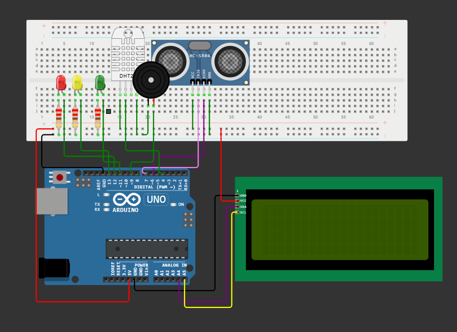

# Monitor Inteligente de Nível com Alerta Visual e Sonoro

## 🧩 Descrição do Problema

Em áreas urbanas e rurais, enchentes representam um risco constante à vida, à infraestrutura e ao meio ambiente. O aumento repentino do nível da água causado por chuvas intensas pode passar despercebido até se tornar um perigo iminente. A falta de sistemas de alerta precoce dificulta a prevenção de danos e coloca comunidades inteiras em risco.

## ✅ Solução Proposta

Este projeto utiliza um **sensor ultrassônico** para medir o nível do reservatório, **LEDs** para indicar o status (seguro, alerta, crítico), **buzzer** para aviso sonoro, e um **display LCD** para exibir o nível, temperatura e umidade do ambiente em tempo real. 

## 🔧 Componentes Utilizados

- 1x Arduino UNO (ou similar)
- 1x Sensor Ultrassônico HC-SR04
- 1x Sensor de Temperatura e Umidade DHT22
- 1x Display LCD 16x2 com interface I2C
- 3x LEDs: verde, amarelo e vermelho
- 1x Buzzer
- Resistores (220Ω) para os LEDs
- Protoboard e jumpers

## 🧪 Simulação Online

Você pode simular este projeto gratuitamente nas plataformas abaixo:

- **Wokwi**: [🔗 Acessar Projeto no Wokwi](https://wokwi.com/projects/432239604591179777)

## 🎥 Vídeo Demonstrativo

Assista ao funcionamento do projeto neste vídeo:

[📺 Link para o vídeo demonstrativo](https://youtu.be/QRd0QtXXtOc)

## 📟 Funcionamento

1. O sensor HC-SR04 mede a distância até o líquido e calcula o nível.
2. O sensor DHT22 mede temperatura e umidade.
3. O LCD exibe as informações.
4. LEDs e buzzer atuam conforme a distância:
   - **> 20 cm**: LED verde (normal)
   - **10–20 cm**: LED amarelo (atenção)
   - **< 10 cm**: LED vermelho + buzzer (alerta)

## 💻 Código Fonte

- Comentado e estruturado para facilitar o entendimento
- Utiliza boas práticas de nomenclatura, indentação e lógica

> Veja o arquivo `Codigo Wokwi` incluído neste repositório.

## 📚 Bibliotecas Necessárias

- `LiquidCrystal_I2C`
- `DHT sensor library by Adafruit`

## 🛠️ Montagem do Circuito

## Integrantes do Grupo:
- Rodrigo RM:561479
- Samuel RM:566244
- João Lucas RM:562608

---

